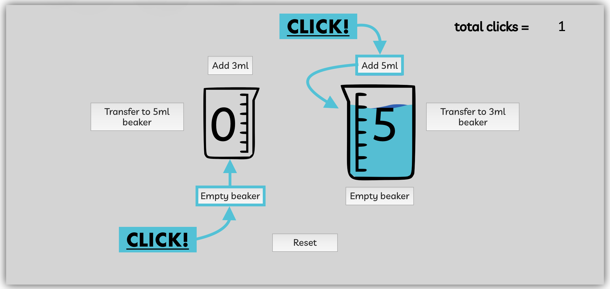
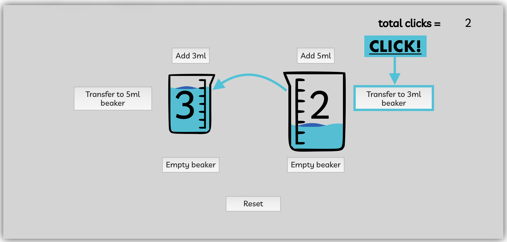
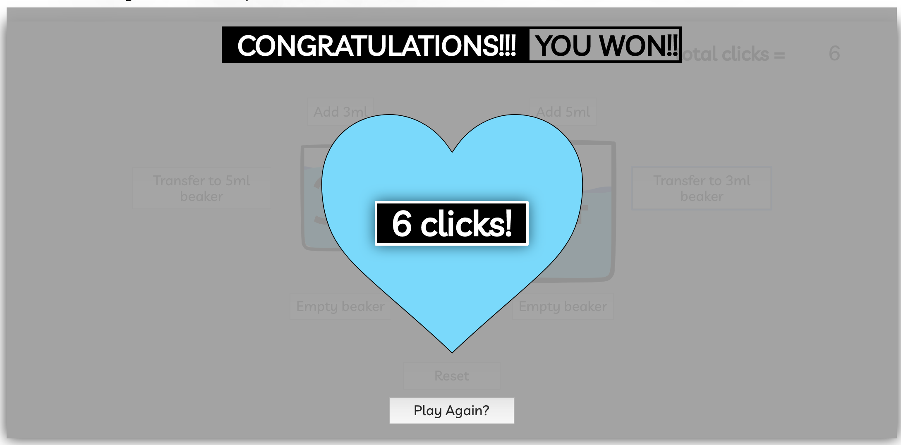

### A fun [game](https://lonelytree.github.io/Scientific-Switcheroo/) to confuse your brain and make you surprisingly thirsty.

### *All at the same time!*

#### Click on the `Add` buttons to increase the volume.
#### Click on the `Empty` buttons to empty out the beaker completely.

#### Click on the `Transfer` buttons to transfer the volume from one beaker to their respective companion.

#### And after a little mental gymnastics, a few minutes of staring at the screen, second guessing your moves, and switching back and forth more times than you'd care for:   

## *`YOU WIN!`*

<h1 style=text-align:center;>Enjoy!</h1>
